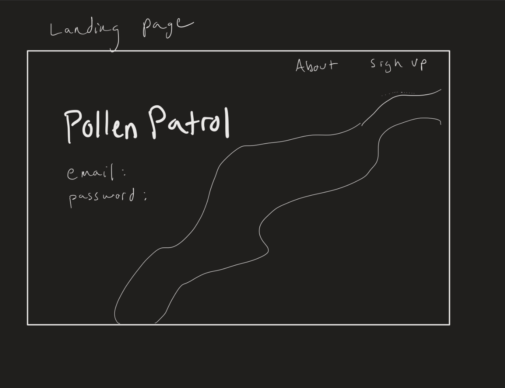
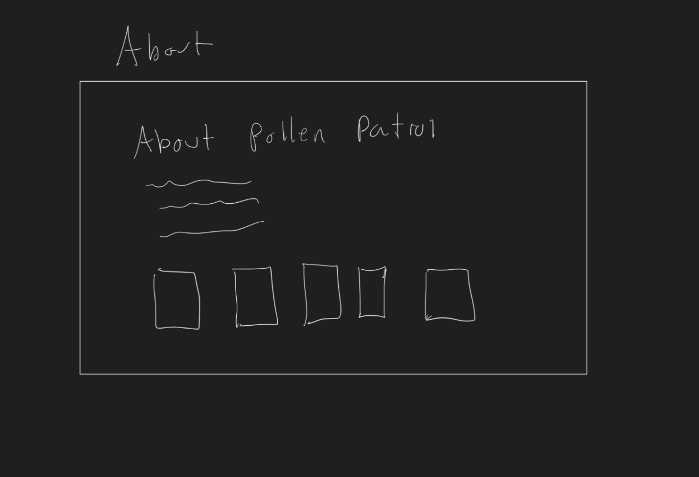
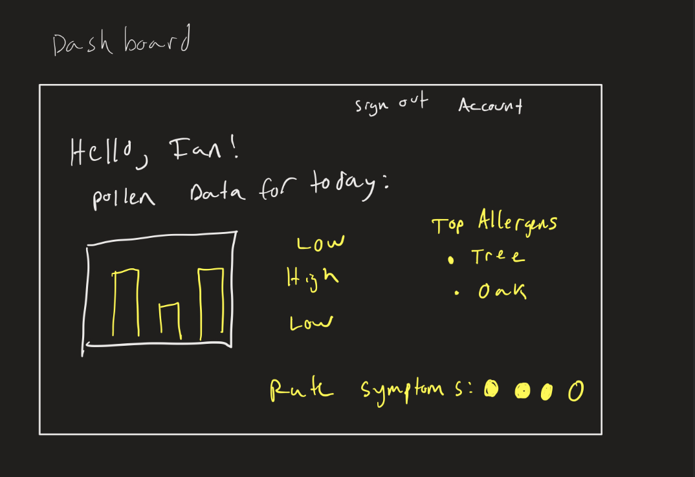
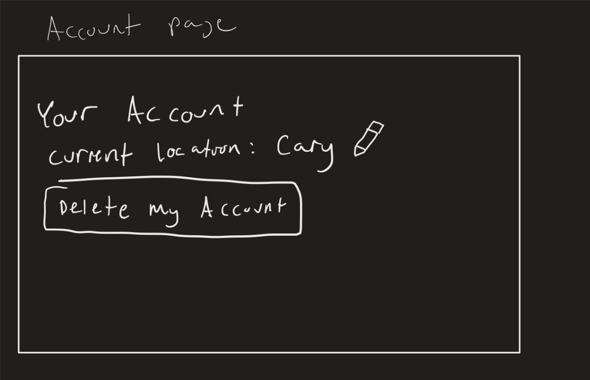

### App Qualities
A web app that tracks pollen levels. Has a dashboard with a graph displaying the levels of different types of pollen and informs the user if pollen levels are high.

### Pages
## Landing Page
Fun design and name (Pollen Patrol). Bee graphic as the icon, the background can be an image with one line of text to welcome the user. Buttons to navigate to Login and About.

## Before Login
# About
Background can be white/light yellow with black text describing project.

# Login
A box in the middle of the page allowing for user input; models a typical login window. Link to navigate to create account page.
# Create Account
Models typical create account form. Asks for name, email, password, password confirmation, and location.
## After Login
# Dashboard
A 5-day pollen forecast graphic (models the weather forecast) Highlights the current day’s forecast. Access profile settings on the side. Information from a pollen API or scraped from 'pollen.com'. Link to Profile Settings page.

# Profile Settings
Allow user to enable notifications and update name, number, and location.

### Roles
* Nila: design, project manager
* Ruth: backend, plan manager
* Kadhir: database, documentation manager
* Ian: frontend, backend connection, release manager
* Jayden: frontend, design, review manager